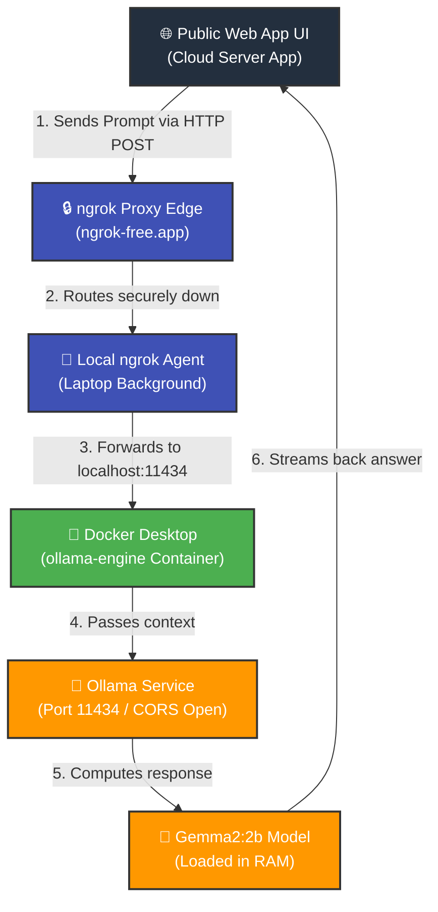

# 🔌 Hybrid Local AI Workspace

This repository sets up a secure, public web interface that routes queries down to a local RAG (Retrieval-Augmented Generation) data engine running on a home machine using **Ollama** and **ngrok**.

---

## 🌐 Architecture Diagram

The diagram below illustrates how traffic flows from the public web interface through the secure ngrok tunnel into the local Docker container workspace.



---

## 📁 Repository Structure

```text
hybrid-local-ai-workspace/
├── cloud-web-files/
│   ├── app.py             # Streamlit / Web UI deployment code
│   └── requirements.txt   # Web engine dependencies
└── laptop-engine-files/
    ├── compose.yaml       # Docker Compose setup for Ollama
    ├── start.bat          # Windows automation launch script
    └── start.sh           # Linux/Mac bash launch script
```

---

## 🚀 Setup & Installation

### 1. Local Laptop Setup
Ensure your local container allows cross-origin requests (`OLLAMA_ORIGINS="*"`) so the web app can communicate with it:

```bash
# Stop and remove any conflicting container instances
docker stop ollama-engine
docker rm ollama-engine

# Run the container with permanent volume mapping and open network origins
docker run -d -v ollama:/root/.ollama -p 11434:11434 -e OLLAMA_ORIGINS="*" --name ollama-engine ollama/ollama:latest
```

Ensure the model required by the web application matches what is inside your container:
```bash
docker exec -it ollama-engine ollama pull gemma2:2b
```

### 2. Expose the Network Link
Run your terminal tunnel agent natively to map your port to the outside web network:
```powershell
& "D:\localai\ngrok-v3-stable-windows-amd64\ngrok.exe" http 11434
```

---

## 🛠️ Daily Operational Checklist

1. **Verify Engine Core:** Ensure Docker Desktop is open and `ollama-engine` is listed as `Up`.
2. **Ignite the Bridge:** Launch the `ngrok` pipeline to generate a fresh forwarding address.
3. **Bind the Endpoint:** Copy the generated `https://*.ngrok-free.app` link and drop it right into the **Connection Tunnel Settings** container field on the interface dashboard.
