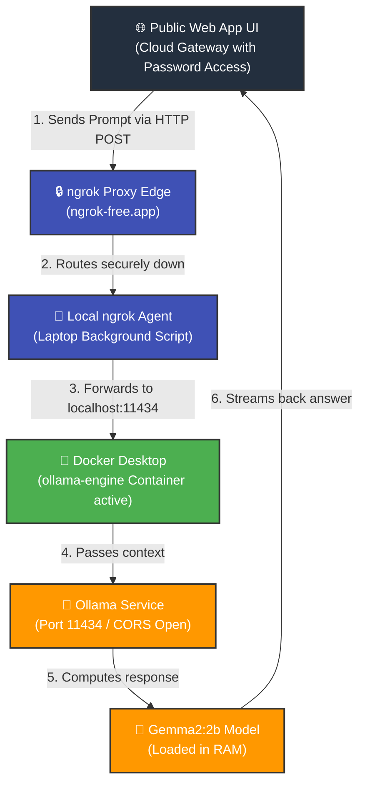

# 🔌 Hybrid Local AI Workspace

This repository sets up a secure, public web interface that routes queries down to a local RAG (Retrieval-Augmented Generation) data engine running on a home machine using **Ollama** and **ngrok**.

---

## 🌐 Architecture Diagram

The diagram below illustrates how traffic flows from the public web interface through the secure ngrok tunnel into the local Docker container workspace.



---

## 📁 Repository Structure

```text
hybrid-local-ai-workspace/
├── cloud-web-files/
│   ├── app.py             # Streamlit App Gateway with Session Password Lock
│   └── requirements.txt   # Web engine dependencies
└── laptop-engine-files/
    ├── compose.yaml       # Docker Compose setup for Ollama
    ├── start.bat          # One-click port optimizer and ngrok launcher
    └── start.sh           # Linux/Mac bash launch script
```

---

## 🔐 Secrets Configuration

To hide your access password from public GitHub view, configure the application gateway using **Streamlit Secrets**:
1. Navigate to your **Streamlit Cloud Dashboard -> Settings -> Secrets**.
2. Store your credentials in TOML format:
   ```toml
   access_password = "your_private_chosen_password"
   ```

---

## 🚀 Setup & Installation

### 1. Local Laptop Setup
Ensure your local container allows cross-origin requests (`OLLAMA_ORIGINS="*"`) so the web app can communicate with it:

```bash
# Stop and remove any conflicting container instances
docker stop ollama-engine
docker rm ollama-engine

# Run the container with permanent volume mapping and open network origins
docker run -d -v ollama:/root/.ollama -p 11434:11434 -e OLLAMA_ORIGINS="*" --name ollama-engine ollama/ollama:latest
```

Download the specific model variation targeted by the frontend environment configuration:
```bash
docker exec -it ollama-engine ollama pull gemma2:2b
```

---

## 🛠️ Daily Operational Checklist

1. **Ignite the Automations:** Double-click the optimized **`start.bat`** file icon on your laptop. This automatically clears background Open WebUI port blocks, boots the engine core, and opens the dark ngrok proxy console workspace.
2. **Bind the Endpoint Link:** Copy the fresh generated dynamic `https://*.ngrok-free.app` URL forwarding string from the command interface.
3. **Unlock the Portal Dashboard:** Open your public site link, authenticate with your master gateway password, paste the URL into the **Connection Tunnel Settings** container field, and start chatting!
